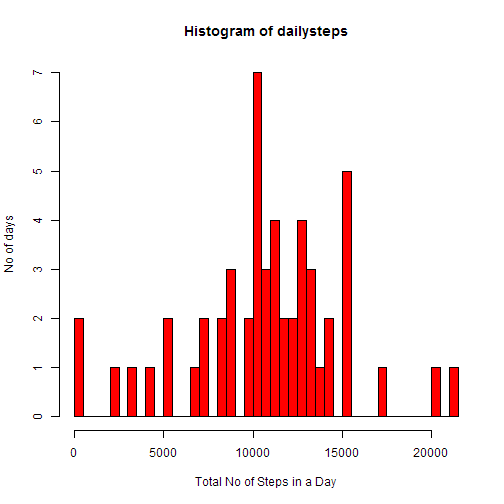
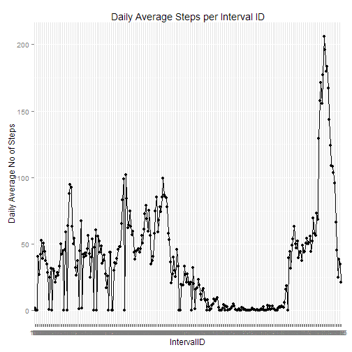
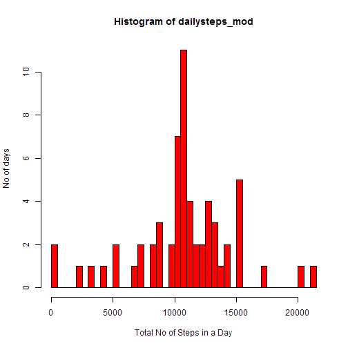
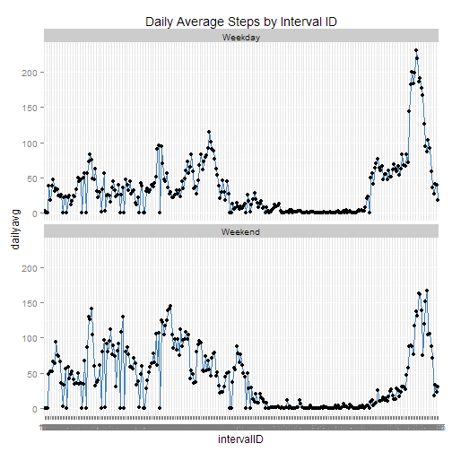

##Loading and preprocessing the data

1. Show any code that is needed to load the data (i.e. read.csv())
2. Process/transform the data (if necessary) into a format suitable for your analysis

Initiate dplyr package and import data

```r
library(dplyr)
df<-read.csv("activity.csv")
```

Exclude NA values from data table. Assign new data table "dt2", and drop unused factor levels.

```r
##use dplyr package
dt<-tbl_df(df)
dt2<-filter(dt,!is.na(steps))
dt2<-droplevels(dt2)
print(dt2)
```

```
## Source: local data frame [15,264 x 3]
## 
##    steps       date interval
## 1      0 2012-10-02        0
## 2      0 2012-10-02        5
## 3      0 2012-10-02       10
## 4      0 2012-10-02       15
## 5      0 2012-10-02       20
## 6      0 2012-10-02       25
## 7      0 2012-10-02       30
## 8      0 2012-10-02       35
## 9      0 2012-10-02       40
## 10     0 2012-10-02       45
## ..   ...        ...      ...
```

##What is mean total number of steps taken per day?

1. For this part of the assignment, you can ignore the missing values in the dataset.

```r
##Report Total Steps
dailysteps<-tapply(dt2$steps,dt2$date,sum)
```

2. Make a histogram of the total number of steps taken each day

```r
hist1<-hist(dailysteps,breaks=50,ylab="No of days",xlab="Total No of Steps in a Day",col="red")
```

 

3. Calculate and report the mean and median total number of steps taken per day

```r
#Report Mean/Median of total steps
mean(dailysteps)
```

```
## [1] 10766.19
```

```r
median(dailysteps)
```

```
## [1] 10765
```

##What is the average daily activity pattern?

1. Make a time series plot (i.e. type = "l") of the 5-minute interval (x-axis) and the average number of steps taken, averaged across all days (y-axis)

Create new dataset ordered by interval

```r
dt3<-arrange(dt2,interval)
print(dt3)
```

```
## Source: local data frame [15,264 x 3]
## 
##    steps       date interval
## 1      0 2012-10-02        0
## 2      0 2012-10-03        0
## 3     47 2012-10-04        0
## 4      0 2012-10-05        0
## 5      0 2012-10-06        0
## 6      0 2012-10-07        0
## 7      0 2012-10-09        0
## 8     34 2012-10-10        0
## 9      0 2012-10-11        0
## 10     0 2012-10-12        0
## ..   ...        ...      ...
```

Apply means across different interval values for no of steps

```r
dailyavg<-tapply(dt3$steps,dt3$interval,mean)
```

Store interval ID in new variable

```r
intervalID<-rownames(dailyavg)
```

Remove existing table rownames for subsequent processing

```r
rownames(dailyavg)<-NULL
```

Create tidy data frame containing average steps by interval

```r
dailyavg2<-data.frame(intervalID,dailyavg)
```

Use ggplot2 for plotting. Initialize relevant package, define variables to be plotted under aes(), include points,line and relevant labels.

```r
library(ggplot2)
g<-ggplot(dailyavg2,aes(intervalID,dailyavg))
g+geom_point()+geom_line()+aes(group=1)+labs(title="Daily Average Steps per Interval ID")+labs(y="Daily Average No of Steps")+labs(x="IntervalID")
```

 

2. Which 5-minute interval, on average across all the days in the dataset, contains the maximum number of steps?

Reorder data in descending order and take the first row. *data.table* package is used to temporarily convert data frame into table in order to use arrange()

```r
library(data.table)
dailyavg3<-arrange(as.data.table(dailyavg2),desc(dailyavg),desc(intervalID))
print(dailyavg3)
```

```
##      intervalID dailyavg
##   1:        835 206.1698
##   2:        840 195.9245
##   3:        850 183.3962
##   4:        845 179.5660
##   5:        830 177.3019
##  ---                    
## 284:        215   0.0000
## 285:        205   0.0000
## 286:        200   0.0000
## 287:        155   0.0000
## 288:        120   0.0000
```

```r
print(dailyavg3[1,])
```

```
##    intervalID dailyavg
## 1:        835 206.1698
```

##Inputing missing values

1. Note that there are a number of days/intervals where there are missing values (coded as NA). The presence of missing days may introduce bias into some calculations or summaries of the data. Calculate and report the total number of missing values in the dataset (i.e. the total number of rows with NAs)

```r
dt_NA<-filter(dt,is.na(steps))
dim(dt_NA)[[1]]
```

```
## [1] 2304
```


2. Devise a strategy for filling in all of the missing values in the dataset. The strategy does not need to be sophisticated. For example, you could use the mean/median for that day, or the mean for that 5-minute interval, etc.

Create new column containing numeric logical on whether NA is present. 

```r
dt4<-mutate(dt,na_check=as.numeric(is.na(steps)))
```

Loop each observation to create new entry in another column. For NA rows, it will match the interval ID to the daily mean values obtained in dailyavg2, and store it in the new column. For non-NA rows, the same value of "steps" is retained. *newcol* is the new column containing modified "steps" data with filled NA values.

```r
no_obs<-dim(dt4)[[1]]

for(i in 1:no_obs){
        
        if(dt4[i,"na_check"]==1){
                dt4[i,"newcol"]<-dailyavg2[match(dt4[i,"interval"],dailyavg2$intervalID),"dailyavg"]
        }
        else {
                dt4[i,"newcol"]<-dt4[i,"steps"]
        }
        
}
```

3. Create a new dataset that is equal to the original dataset but with the missing data filled in.

Extract the new column containing filled values, corresponding date and interval columns

```r
dt5<-select(dt4,newcol,date,interval)
print(dt5)
```

```
## Source: local data frame [17,568 x 3]
## 
##       newcol       date interval
## 1  1.7169811 2012-10-01        0
## 2  0.3396226 2012-10-01        5
## 3  0.1320755 2012-10-01       10
## 4  0.1509434 2012-10-01       15
## 5  0.0754717 2012-10-01       20
## 6  2.0943396 2012-10-01       25
## 7  0.5283019 2012-10-01       30
## 8  0.8679245 2012-10-01       35
## 9  0.0000000 2012-10-01       40
## 10 1.4716981 2012-10-01       45
## ..       ...        ...      ...
```

5. Make a histogram of the total number of steps taken each day and Calculate and report the mean and median total number of steps taken per day. Do these values differ from the estimates from the first part of the assignment? What is the impact of imputing missing data on the estimates of the total daily number of steps?

```r
dailysteps_mod<-tapply(dt5$newcol,dt5$date,sum)
hist2<-hist(dailysteps_mod,breaks=50,ylab="No of days",xlab="Total No of Steps in a Day",col="red")
```

 

```r
mean(dailysteps_mod)
```

```
## [1] 10766.19
```

```r
median(dailysteps_mod)
```

```
## [1] 10766.19
```
When missing data was present, the median is lower than the mean. After adding filling in the NA values with daily average steps, the mean and median is now equal.

##Are there differences in activity patterns between weekdays and weekends?

1. For this part the weekdays() function may be of some help here. Use the dataset with the filled-in missing values for this part.Create a new factor variable in the dataset with two levels -- "weekday" and "weekend" indicating whether a given date is a weekday or weekend day.

```r
for(i in 1:no_obs){
        ##use boolean logic on character match for Saturday and Sunday
        dt5[i,"day"]<-weekdays(as.POSIXlt(dt5[i,"date"][[1]]))
        if(dt5[i,"day"]=="Saturday"){dt5[i,"dayclass"]<-"Weekend"}
        else if(dt5[i,"day"]=="Sunday"){dt5[i,"dayclass"]<-"Weekend"}
        else{dt5[i,"dayclass"]<-"Weekday"}
                        
}

#split data to weekend/weekday
dt6<-split(dt5,dt5$dayclass)
#obtain step means by interval within each subset of weekday/weekend
weekdaymeans<-tapply(dt6$Weekday$newcol,dt6$Weekday$interval,mean)
weekendmeans<-tapply(dt6$Weekend$newcol,dt6$Weekend$interval,mean)

#remove rownames
rownames(weekdaymeans)<-NULL
rownames(weekendmeans)<-NULL

tidy_weekday<-data.frame(weekdaymeans,intervalID,rep("Weekday",dim(weekdaymeans)))
names(tidy_weekday)<-c("dailyavg","intervalID","day")
tidy_weekend<-data.frame(weekendmeans,intervalID,rep("Weekend",dim(weekendmeans)))
names(tidy_weekend)<-c("dailyavg","intervalID","day")

##tidy data with relevant columns is created with the rbind
tidy_data<-rbind(tidy_weekday,tidy_weekend)
```


2. Make a panel plot containing a time series plot (i.e. type = "l") of the 5-minute interval (x-axis) and the average number of steps taken, averaged across all weekday days or weekend days (y-axis).

Use vertical facet to show clearer comparison across the interval for both weekday and weekend.

```r
g2<-ggplot(tidy_data,aes(intervalID,dailyavg))
g2+geom_line(color="steelblue")+facet_wrap(~day,ncol=1)+aes(group=1)+geom_point()+labs(title="Daily Average Steps by Interval ID")
```

 
